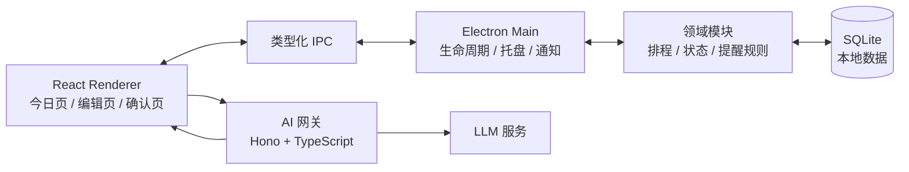

# AI 个性化 ToDo MVP 技术方案

**文档状态**：MVP 技术方案

**版本**：v0.1

**对应产品文档**：[AI_TODO_产品设计文档.md](../AI_TODO_产品设计文档.md)

## 1. 方案结论

MVP 采用本地优先的桌面应用形态，推荐技术栈如下：

| 层次 | 技术选择 | 主要职责 |
| --- | --- | --- |
| 桌面容器 | Electron | 应用生命周期、托盘、后台运行、系统通知、开机启动 |
| 用户界面 | React + TypeScript + Vite | 今日页、任务录入、计划确认、提醒卡片、重排确认 |
| 本地数据 | SQLite | 任务、计划版本、提醒节点、进度和复盘记录 |
| 本地状态 | Zustand | 当前页面状态、编辑中的计划草稿、提醒卡片状态 |
| 数据校验 | Zod | 表单、IPC 消息和 AI 返回结果的运行时校验 |
| 领域逻辑 | TypeScript 纯函数模块 | 计划计算、冲突检测、提醒节点生成、状态流转 |
| AI 网关 | Node.js + TypeScript + Hono | 隐藏模型密钥、调用模型、校验和规范化 AI 结果 |
| 测试 | Vitest、React Testing Library、Playwright | 领域逻辑、界面交互和关键闭环验证 |
| 构建发布 | electron-builder + GitHub Actions | Windows 优先的安装包构建和发布 |

MVP 不建设账号系统、云同步、独立数据库集群、消息队列或复杂的个性化模型。

## 2. 设计原则

1. **本地数据优先**：任务和执行记录默认只保存在用户设备上。
2. **AI 只提供建议**：AI 不直接写入已确认计划，所有变更必须经过用户确认。
3. **规则决定时间**：排程、冲突检测和提醒节点由可测试的本地规则引擎负责，不能交给模型自由生成。
4. **计划版本不可覆盖**：每次确认和重排都保存新的计划版本，保留调整前后的差异。
5. **提醒可恢复**：提醒节点持久化到 SQLite；应用重启后能够恢复和校正未触发节点。
6. **先保证闭环**：先验证“输入任务 → 计划 → 跟进 → 原因 → 重排 → 继续执行”，再增加个性化能力。

## 3. 总体架构

### 3.1 Renderer 层

Renderer 只负责展示和用户交互，不直接访问文件系统、数据库或模型密钥。它通过类型化 IPC 调用主进程能力，主要包含：

- 今日时间线和任务状态展示。
- 任务、可用时间和提醒设置编辑。
- AI 建议的展示、修改和确认。
- 快捷进度反馈。
- 延期原因和重排结果确认。

### 3.2 Main 层

Electron Main 进程是桌面应用的常驻核心，负责：

- 创建窗口、托盘菜单和单实例控制。
- 监听系统生命周期和应用退出。
- 运行提醒调度器，并发送系统通知。
- 通过 IPC 向 Renderer 推送任务和提醒事件。
- 调用本地数据库和领域模块。

### 3.3 领域模块

领域模块保持为不依赖 Electron 的 TypeScript 纯函数或小型服务，方便单元测试。建议拆分为：

- `planning`：根据任务、优先级、截止时间和可用时间计算参考计划。
- `conflict`：识别时间不足、不可用时间段和未安排任务。
- `reminder`：根据确认耗时和提醒策略生成提醒节点。
- `task-state`：处理任务和计划状态转换。
- `replanning`：根据剩余任务、剩余时间和用户反馈生成重排输入及结果。
- `versioning`：生成计划快照和前后版本差异。

## 4. AI 调用边界

### 4.1 适合交给 AI 的能力

- 将自然语言批量任务整理成结构化任务。
- 给出预计耗时、依据和不确定性说明。
- 对笼统目标生成 3～7 个可执行子任务。
- 根据延期原因和当前上下文提出重排建议。
- 生成面向用户的解释文案。

### 4.2 不交给 AI 的能力

- 最终时间排程和不可用时间校验。
- 提醒节点的实际触发。
- 任务状态和计划版本的持久化。
- 未经用户确认直接修改计划。
- 读取不在当前请求范围内的本地数据。

### 4.3 AI 接口约束

AI 网关提供少量明确的操作接口，例如：

| 操作 | 输入 | 输出 |
| --- | --- | --- |
| `parse_tasks` | 用户原始文本 | 结构化任务草稿 |
| `estimate_tasks` | 任务草稿及上下文 | 估时、依据、不确定性 |
| `decompose_task` | 目标及约束 | 子任务建议 |
| `suggest_replan` | 当前计划、进度、原因、剩余时间 | 新计划建议及影响说明 |

所有输出必须使用 JSON Schema/Zod 校验。校验失败、超时或模型不可用时，客户端保留当前计划，并允许用户手动继续编辑；不能因为 AI 失败而丢失任务。

AI 网关初期保持无状态，不保存用户的任务历史。模型 API Key 只放在服务端环境变量中；如果未来支持用户自带 API Key，需要单独设计本地密钥存储和权限提示。

## 5. 本地数据设计

SQLite 作为本地唯一事实来源。建议使用迁移脚本管理表结构，日期时间统一保存为带时区的 ISO 8601 字符串或 UTC 时间戳，展示时转换为用户本地时间。

### 5.1 核心表

| 表 | 关键字段 | 说明 |
| --- | --- | --- |
| `tasks` | `id`, `title`, `priority`, `deadline`, `status` | 任务当前信息 |
| `task_estimates` | `task_id`, `ai_minutes`, `confirmed_minutes`, `reason` | AI 估时和用户确认耗时分开保存 |
| `availability_windows` | `id`, `start_at`, `end_at`, `kind` | 可用时间和临时占用时间 |
| `plans` | `id`, `day`, `status`, `current_version_id` | 某一天的计划聚合信息 |
| `plan_versions` | `id`, `plan_id`, `version_no`, `created_at`, `confirmed_at` | 每次确认后的计划快照 |
| `plan_items` | `version_id`, `task_id`, `start_at`, `end_at`, `order_no` | 计划版本中的任务安排 |
| `reminders` | `id`, `task_id`, `kind`, `due_at`, `status` | 开始、检查点和结束提醒 |
| `progress_events` | `id`, `task_id`, `reminder_id`, `event_type`, `created_at` | 用户的进度和中断反馈 |
| `replan_events` | `id`, `from_version_id`, `to_version_id`, `reason`, `diff_json` | 重排原因及版本差异 |

原始任务文本、AI 结果和用户修改记录应保留必要的审计信息，但避免无期限保存冗余 Prompt 或敏感内容。

### 5.2 计划版本规则

- 编辑中的内容属于草稿，不创建可执行提醒。
- 用户确认时，以事务方式写入新的 `plan_version`、`plan_items` 和 `reminders`。
- 重排确认时不修改旧版本，而是创建新版本并将其设为当前版本。
- 旧提醒标记为取消或失效，新版本只生成尚未发生的提醒。
- 删除全部本地数据时，删除数据库中的业务数据和本地日志，并重新初始化空数据库。

## 6. 提醒与后台调度

提醒调度是 MVP 的关键基础能力，建议采用“持久化节点 + 常驻调度器”的方式：

1. 计划确认后，根据用户确认耗时生成开始提醒、检查点和结束提醒。
2. 每个提醒节点写入 SQLite，状态包括 `pending`、`sent`、`skipped`、`cancelled` 和 `expired`。
3. Main 进程只等待最近的一个待处理节点，到期后再次从数据库读取并触发。
4. 用户跳过、延后或关闭提醒时，更新节点状态，并重新计算尚未触发的节点。
5. 应用启动、从睡眠恢复或系统时间变化后，执行一次调度校正：检查过期节点、避免重复发送，并同步当前任务状态。
6. 用户未回复时不连续发送相同提醒；频率限制和“本任务关闭后续提醒”都作为持久化设置保存。

提醒调度不能只放在 React 页面或浏览器计时器中，否则窗口关闭、页面刷新或浏览器休眠时容易丢失提醒。

## 7. 主要业务流程

### 7.1 生成和确认计划

1. Renderer 提交原始任务文本和可用时间段。
2. AI 网关返回结构化任务和估时建议。
3. 本地领域模块根据规则计算时间表、缓冲和冲突。
4. UI 展示建议、依据、冲突和未安排任务。
5. 用户修改后重新计算；只有点击确认才创建可执行计划版本和提醒节点。

### 7.2 执行和进度同步

1. 调度器触发通知并推送提醒卡片。
2. 用户选择进度、被打断、阻塞、延长或完成。
3. 反馈以事件形式写入 `progress_events`，同时更新任务当前状态。
4. 任务完成后记录实际开始和结束时间，并停止剩余提醒。

### 7.3 延期和重排

1. 任务超时或用户反馈异常时，任务进入临时的“等待反馈”状态。
2. UI 先收集延期原因，不立即移动后续任务。
3. AI 根据当前版本、剩余时间和原因生成建议。
4. 本地规则模块校验建议是否违反可用时间和基本约束。
5. UI 展示受影响任务及时间变化。
6. 用户确认后创建新计划版本，更新提醒和今日时间线。

## 8. 安全与隐私

- Renderer 使用 Electron 的 `contextIsolation` 和受限 preload API，禁止把 Node 能力直接暴露给页面。
- IPC 接口采用白名单和 Zod 校验，拒绝任意文件路径、SQL 或命令调用。
- AI 网关不保存长期用户画像，日志中对任务内容做脱敏或关闭正文记录。
- 本地删除入口必须真正删除任务、计划、提醒、反馈和相关日志。
- 应用安装包和自动更新发布前，配置代码签名，降低系统通知和安装体验问题。
- MVP 不实现账号和云同步，因此需要在产品界面明确说明：数据只保存在当前设备。

## 9. 测试与验收

### 9.1 单元测试

- 不同任务时长生成正确数量的检查点。
- 不可用时间段不会被排入计划。
- 时间不足时正确保留冲突和未安排任务。
- 任务和计划状态转换符合状态机。
- 重排只取消尚未触发的旧提醒。
- 应用从睡眠或重启恢复时不会重复发送提醒。

### 9.2 集成测试

- SQLite 迁移、事务写入和计划版本快照。
- 确认计划后同时生成计划项和提醒节点。
- 重排确认后旧版本、新版本、提醒和时间线保持一致。
- AI 返回缺字段、非法时间或超时后，当前草稿和已确认计划不受破坏。

### 9.3 端到端测试

至少覆盖产品文档中的完整闭环：

1. 输入多个任务和多个可用时间段。
2. 生成包含估时、冲突和未安排任务的计划。
3. 修改并确认计划。
4. 接收提醒并提交进度。
5. 提交延期原因。
6. 查看重排影响并确认新安排。
7. 验证今日时间线、提醒和历史记录同步更新。

## 10. 发布和运维

### 10.1 MVP 发布策略

- 首先支持 Windows，验证托盘、通知、开机启动和睡眠恢复。
- 使用 GitHub Actions 构建安装包，并在发布前进行代码签名。
- AI 网关部署为单一无状态服务，使用环境变量管理模型配置。
- 本地数据库提供导出前的内部调试能力，但不在 MVP 对用户开放数据导出功能。

### 10.2 可观测性

客户端只记录必要的错误、调度失败和版本信息，不记录完整任务正文。AI 网关记录请求耗时、错误类型和模型调用状态，不记录可识别的任务内容。

## 11. 后续演进

当 MVP 验证核心闭环有效后，再考虑：

- 用历史实际耗时校准估时。
- 根据用户反馈调整提醒频率。
- 增加周计划、重复任务和跨天排程。
- 引入账号、云同步和移动端。
- 将本地 SQLite 数据同步到服务端数据库。

在引入同步前，应保持领域模块与 Electron 解耦，使本地计划规则可以复用到移动端或 Web 客户端。

## 12. 关键决策与待确认事项

当前方案的关键决策是“Electron 优先、Windows 优先、无账号本地优先”。正式开发前还需要确认：

1. 是否接受任务内容发送到第三方模型服务。
2. AI 网关由产品方提供统一额度，还是支持用户自带 API Key。
3. 首个发布平台是否只做 Windows。
4. 是否需要允许用户在应用完全退出后仍收到提醒；如果需要，需要额外评估开机启动、系统休眠和进程被系统终止等边界。
